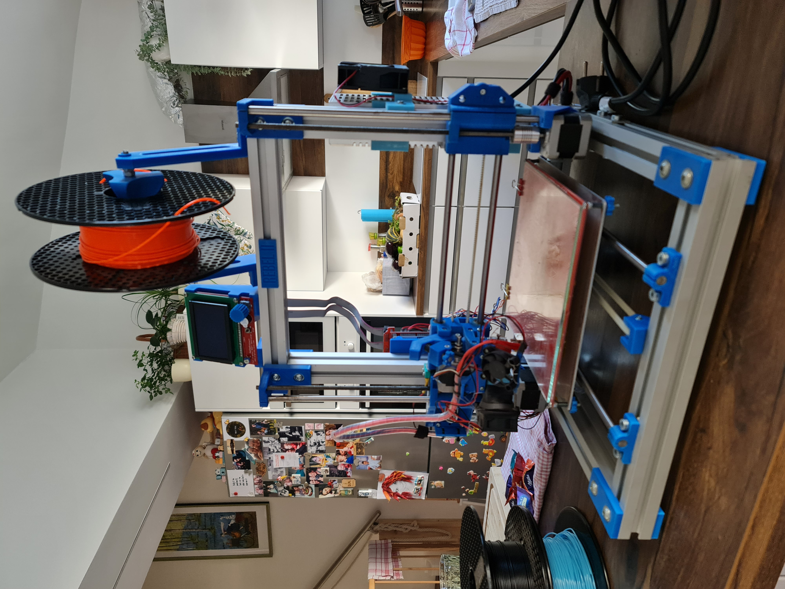
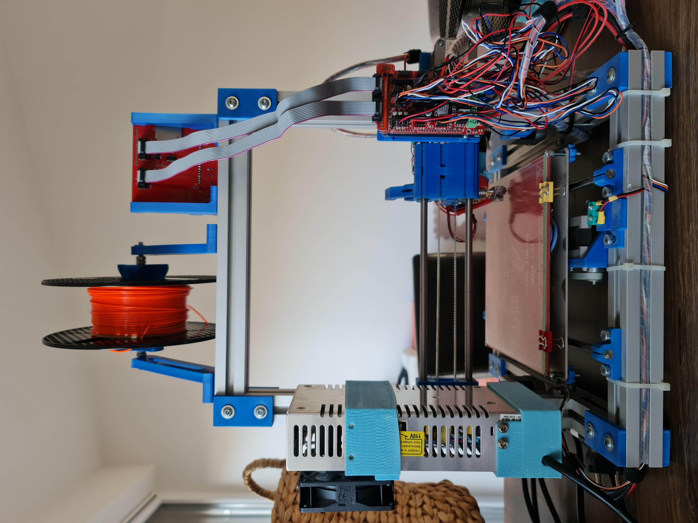
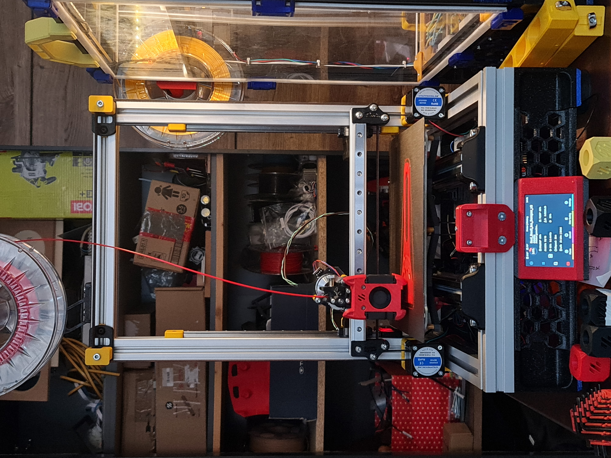

# Rebel 2 Switchwire clone

Rebel2 3D printer to Voron Switchwire conversion

Rebel2 is a czech republic very own, community based 3D printer project that was very popular back in around 2014. It was fairly cheap and quite easy to build machine and as any other DIY/open source style 3D printer, it was also highly mod-able :-)

Here's one ...mine... as I got it from my good friend... it was a pretty good trade, two bottles of gin for a 3D printer, I give and take :-)

 

Well, take it with a grain of salt, this was my very first 3D printer and the date was sometime in 2022, little late to the party, but still happy to have joined!! 

Over next year and a half, many things had happened to this machine, first came necessary fixes as it wasn't fully operational when I brought it home. Missing Z driver was the main culprit at the time, but hey, took me a little while to diagnose that since again, it was the very first 3D printer I got my hands on and I first had to understand how it even works before I was able to diagnose issues and fix those :-)

Years passed, motors have been turning and trust me they have been turning a lot and getting hot too :-) And then I discovered the Vorons family... oh boy, I shouldn't have... but I did and am still loving it! Decided to build a self-sourced Trident and so I did that over the course of roughly 6 months and then ...does it happen to you all too, you get one 3D printer, sooner or later you want to build another one and as if two were not enough, the urge to build a third printer is starting to crawl from the back of the mind... you know where I'm going to with this, don't you?

And in the meantime, R2 was getting some serious upgrades, every single plastic part got replaced, probably twice if I remember well. Z motors got replaced with new ones with integrated trapeziod rods, X & Y motors got replaced with ones with higher torque / amps, then the old LCD got replaced with newer BTT mini style LCD and so on... of course the toolhead didn't go abandonded, that got replaced as well at least three times... the final one, that's still on there is the Dragon Burner.

And so then another idea was born... to continue the path towards bettering the layers in every direction, mostly Z though, I decided to mod this machine to become the ...most likely... very first <b>Rebel2 Switchwire clone</b>.

Better photos will be provided later...

This repository is just for anyone who owns Rebel2 printer and is a DIY person day and night... STLs are in the folder already, most of it is funtional. The only thing that's not been tested are the plexi panels - I added the support structure, which I have printed and mounted to the machine (photo to be added), but I haven't ordered the plexi glass yet. I will add dxf files for each plexi glass, but it will be sort of "at your own risk" for the time being.

FYI: It's not a super cheap rebuild, I've changed basically every single component on that machine including all electronics and power supply. Linear rails can be obtained on AliExpress for well cheaper than HIWIN or the brand sold by sharplayers.cz and they are good enough. The brand I can recommend is [RDBB](https://vi.aliexpress.com/item/1005001549115363.html?spm=a2g0o.productlist.main.19.7a20idDBidDB4H&algo_pvid=668dc950-613d-42e5-a506-44741d15745c&algo_exp_id=668dc950-613d-42e5-a506-44741d15745c-9&pdp_npi=4%40dis%21EUR%2110.69%2110.69%21%21%2111.22%2111.22%21%402103253917152880300422146e5533%2112000036647035263%21sea%21CZ%21722230593%21&curPageLogUid=h9JmP0pByGXx&utparam-url=scene%3Asearch%7Cquery_from%3A).

The motors were all purchased from [OMC](https://www.omc-stepperonline.com/)

MK52 bed clone also on AliExpress and I can't be any more happier with it.

Electronics is 100% [BigTreeTech](https://biqu.equipment/)
    - BTT SKR PRO 1.2 MCU
    - BTT PI 1.2 
    - BTT EBB36 CAN board
    - BTT U2C board 
    - BTT TFT 3.5" SPI
    - BTT TMC2209 UART drivers
    - BTT microprobe v2 for homing and meshing fun

I'm running this on 24V obviously and that is with 200W PSU and that might be very close to the edge... thinking about upping the PSU to 350W one, but so far it's been running very well for about 6 months.

Just a side note on the microprobe v2 - I've really enjoyed all BTT products so far... except the TFT, it's like the quote from the HBO/Sky Chernobyl series - not great, not terrible. It is actually great ...when it works, but they seem to tend to break over time. I've had it on all my printers, bought two initially, both of them died roughly 6 months into their life, third one seems to work, replacement of the second one seems to have died just about a day into its life and there's another replacement on the way just now. The third one still most likely works, but that printer is WIP and currently without tool head as I can't print ABS because my Voron doesn't have a functional microprobe ;-)
